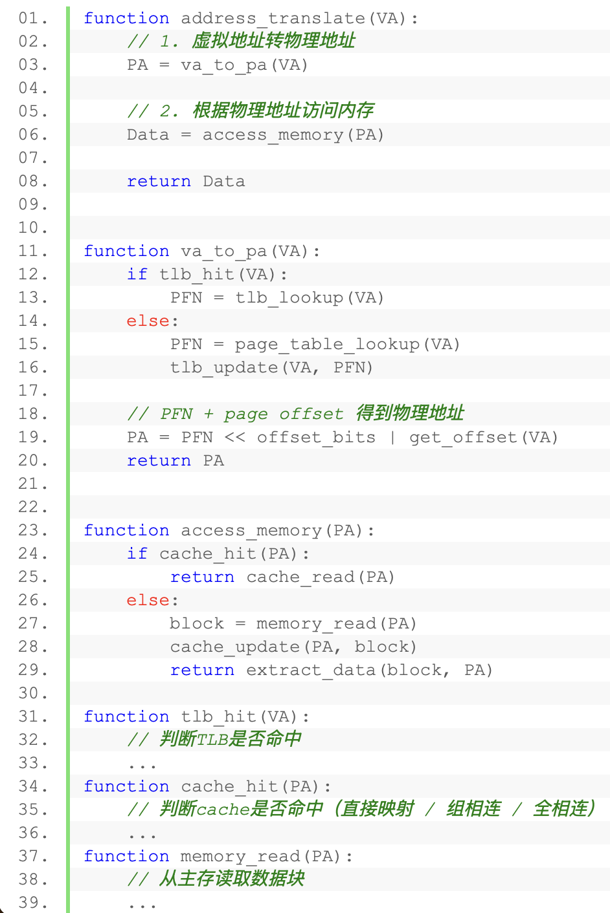

# 🎓 北大上岸经验贴 · 408篇

先给各位同学磕一个🙇‍♂️🙇‍♂️🙇‍♂️真的非常非常抱歉一直没更新，前段时间的各种毕业和考试事务花了太多精力，加上猪波太懒散了，一直没写帖子。我在期末复习软件工程这门课的时候，突然对 408 有了新的感受，我之前说的很多什么流程化、模块化的思路，其实就刚好很符合设计模式中的**策略模式和 SOLID 原则**。

包括我记得学 C++ 的时候老师说：如果任务复杂就要多分几个函数，尽量一个函数完成一个任务，这样才更好 debug。我感觉其实 408 的复习也是如此，下面我准备分三部分来简单说一下我的 408 复习理解：

- 1️⃣ **学习的框架：怎么看待 408**
- 2️⃣ **学习的内容：该学哪些东西**
- 3️⃣ **学习的方法：要怎么复习**

---
第一，从框架来看，我认为，在 408 的学习过程中，一个非常有效的方法就是**借助编程和软件工程的思想**，把知识点拆分为清晰的模块和流程。这种方法类似于编程中的“函数思想”，每一个过程看作独立的函数，函数之间相互调用但又保持相对独立的逻辑，便于定位问题。把复杂的知识**流程化和分块化**。

> ✅ 把学习变成一个清晰的、可定位的过程。

比如拿计算机组成原理里面的地址变化流程来说吧，这个知识点就很适合用函数的视角去看待：我们从最开始的虚拟地址出发，经过 TLB（快表），再查页表，得到物理地址，然后再通过 Cache 缓存或访问内存，最终才得到数据。这一整个流程看起来复杂，但其实可以拆分成几个相对独立的“函数”。以两个函数为例：

```pseudo
第一个函数，专门负责虚拟地址到物理地址的转换（包括 TLB 和页表的查找）。也就是
物理地址 = 虚拟地址转换函数(虚拟地址)

第二个函数，拿到物理地址之后去访问 Cache，再进一步决定如何访问内存。也就是
数据 = 缓存函数(物理地址)

甚至我们可以写出一些伪代码来表示这个过程
```


比如 Cache 这个环节，可能使用全相联映射、组相联映射或直接映射，这些就像软件开发中的**策略模式**，虽然内部实现不同，但对整体流程来说是透明的，完全不会影响你前面虚拟地址转换这一步的理解。

在实际做题中，一定**不要简单地停留在“这道题做不出来”** 这种模糊的感觉上，而是要精准地去**定位自己是在哪一步出了问题**。这种想法和软件工程里的**单一职责原则**非常像，每个环节都明确负责一个功能，一旦出现问题，你立刻就能知道到底是哪个地方没掌握好。

---

第二，从学习内容上，正如我在[学会给任务做减法](./学会给任务做减法.md)这篇中说的，我认为**找到自己应该学哪些东西，然后有舍有得、对症下药地去查漏补缺**，是最稳定且迅速的提分方式。

> 我一直认为：每个同学都应该拿满分，但每个同学的“满分”不一定是一样的。

- 🎯 对于目标 110 分的同学来说：
  - 可能只需要简单地记住“后序线索树不好找后继结点”这样的**结论**，
  - 或者明白“中断处理的顺序由中断处理优先级决定”这个**基本事实**就已经足够。

- 🎯 而目标 140 分的同学：
  - 就必须深入掌握线索树的**构建细节和具体应用方法**，
  - 也要清楚“中断响应优先级”和“中断处理优先级”的**底层原理和它们之间的区别与联系**。

> ⚠️ 没必要为了一些难点知识过度焦虑。

很多时候，同学们因为一些高难度的知识点掌握得不够深入而感到焦虑或沮丧。其实完全没有必要这样。110分目标的同学，完全不用因为没学懂中断的硬件原理而担心或沮丧，你的目标完全可以不涉及到这些内容。

实际上，没达到预期目标的原因往往不是因为上限不够高，而是**下限不够稳**。也就是说**该**掌握的知识点没有牢牢掌握，**该**拿到的题目分数没有真正拿到。

这里的关键在于“该”字，意味着你一定要清楚地知道哪些是自己需要牢牢掌握的内容，然后专注且精确地去学习这些内容。


每个同学都需要认真做的第一步，就是**明确并选择自己真正需要掌握的知识点**，把它们一一学扎实。这样，你的分数自然会稳定且迅速地提升。

---

这个思想其实对目标分数较高的同学意义不大，因为他们本身就是所有知识都要掌握的。而目标没那么高的同学，才更需要学会 **“有舍有得”**。

但其实很坏的是，往往**正是复习效果不佳或刚开始复习的同学，不清楚哪些知识点对自己是必要的、哪些可以适当放弃。**

我这里就简单给一个我感觉**408 如果要 120 的水平应该是什么样**的吧，这也算是进入具体的学习方法了：

> ✨ 一言以蔽之：“看过王道书上所有的字，掌握所有的傻瓜题”。

- 📖 **“读过或者看过所有的字”**：

    这个很好理解，但其实没那么容易做到。  
    一个很常见的现象是：*不管几刷课本，总感觉有些现在觉得重要的知识点或者一句话一个词，之前感觉好像从来没见过一样。*

    这其实是很正常的。毕竟学习过程中难免会走神、精神疲劳，导致许多内容只是“扫”过去，并没有真正记进脑子里，完全不知道自己读过哪些没读过哪些。

    这个很正常，但老实说我感觉也没有什么特别好的方法。

    ✅ **主要是要有这个意识**：
    - 每次看书的时候尽量**保持专注**
    - 做题遇到感觉从来没见过的就去翻翻书，然后读一下**前后一两页相关的内容**
    - 不断地加深印象就可以了
  

- 🧮 **“掌握所有的傻瓜题”**：

    傻瓜题就是指**套路性很强、只换了数字、过程固定的题**。

    就像高数中求极限一样，所有的求极限都是展开——  
    不管这些基本初等函数怎么搭配怎么复合，全都只需要一步步**⚙️机械地**做下去就好了。

    这些题都是很好掌握的，而且都是无脑直接做就行，我感觉可以至少算是初期复习的重点了。

    📌 **比如说：**
    - KMP 的选择题
    - 地址变换的过程
    - 银行家算法
    - TCP 的 seq

    这些看似是难点，其实更是标准的“固定点”，我认为都可以归为可以当成重心的傻瓜题的范围内。这种题目反而最容易掌握，只需要反复做几遍，很快就能形成条件反射般的熟练感。

    ❗ 相对而言，比如说：
    - 算法最优解
    - 中断的过程
    - 同步和互斥
    - 报文在传输中源端口目的端口源地址目的地址的变化

    这些就是更难更深入很多的知识。如果目标是 120 分的话，当然这些知识点都要学，但是**不用像前面那几个一样追求“必须掌握”**。

---

## 🏁 最后我想说的是：

> “按 150 分标准复习丢了 30 分得到的 120 分”和“按 125 分标准复习丢了 5 分得到的 120 分”，虽然最终分数相同，但**复习的思路、方法以及效果却完全不同。**

每个同学的习惯和方法都不一样，**希望大家都能找到适合自己的学习策略，最大化自己的复习效率**！💪
