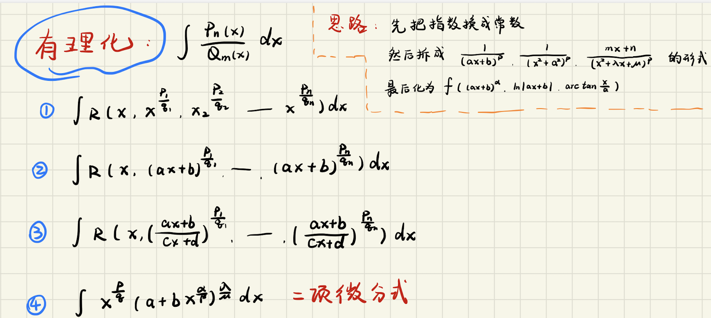

# 🎓 北大上岸经验贴 · 学会总结

这一篇是我觉得也是最关键最重要的一篇，我之前在[注重学习](./注重学习.md)中提到过"最重要也是最难的环节，就是总结"，今天就来详细说说该怎么总结。

如果说学习是输入，那总结就是把输入转化为可以输出的知识。一个好的总结，就是你能够**脱离一切辅助，在白纸上有逻辑地梳理出一个知识块的全貌**。

---

## 📌 什么是好的总结？

好的总结的标志就一句话：**对于那些固定的主题，总结固定的方法和套路，做到看一眼题目就知道大方向是什么。**

- 🎯 **固定的主题**：在考研中其实大部分主题都是固定的，比如极限、积分、地址变换、进程调度等，这些都是常年必考的知识点
- ⚙️ **固定的方法和套路**：对于每个固定主题，其实都有相对固定的方法和思路，虽然题目会各不相同，但是大的框架和思路一定是能套用的
- 👁️ **看一眼题目就知道大方向**：当你看到题目的时候，不是一种"这道题是什么？"的迷茫，而是"这道题是这类题目中的哪一小类？我应该用哪套方法？"的清晰感

### ✨ 验证标准

验证你的总结是否到位，我建议用这个简单粗暴的方法：

**拿一张白纸，合上所有的书和参考资料，看看你能不能有逻辑地、完整地梳理出这个知识块的主要内容。**

这个考验的不是你记得多少细节，而是你是否真正理解了这个知识块的内在逻辑。如果你能在限定时间内通畅地写出来，说明你的总结做得不错。如果卡壳了、逻辑混乱了，说明这块知识还没总结清楚。

---

## 💡 示例
下面我用两个具体的例子来说明什么是好的总结

### 例一：不定积分中的有理函数积分

在数学中，有理函数不定积分（也就是有理化积分）是一个经典的重难点。很多同学看完这一章后只会一种做法：把不定积分题带进来，然后开始算...算到最后要么算对要么算错。但是好的总结应该是什么样呢？

首先我们想，考试时，我们从题目想答案的过程是什么样的？我一般是这样的两阶段：

```
Q: 这是一道有理函数不定积分，我该怎么做？

A: 首先判断，这个有理式是否满足可以积出来的形式？
   ✅ 实系数有理式可以分解成 (二次及以下的多项式) / (一次或二次因子的乘积)
   ✅ 分解完后，所有的项都是可积的标准形式
   
   如果满足：开始拆分和积分
   如果不满足：你可能需要其他方法（比如换元）

Q: 那拆分完了怎么积分呢？

A: 分解后得到的每一项都对应一个固定的积分套路：
   
   类型1：∫A/(x-a) dx = A·ln|x-a| + C
   ✅ 这是最简单的，直接套公式
   
   类型2：∫(Bx+C)/(x²+px+q) dx （其中 x²+px+q 没有实根）
   ✅ 分两步：分子分解为 B(2x+p)/2 + (C-Bp/2)
   ✅ 第一项积分得 B·ln(x²+px+q)
   ✅ 第二项通过配方后用 arctan 公式
   
   类型3：∫A/(x-a)^k dx （k≥2）
   ✅ 套用幂函数的积分公式：∫(x-a)^(-k) dx

   类型n: ...
```

所以对于复习时的总结，需要做到的就是：当你考试碰到有理函数积分题时，你一眼就能看出：
- "哦，这道题我需要先判断能不能拆成标准形式"
- "拆分后我会遇到这几类哪一类？"
- "对应的方法是什么？"

比如我当时的总结结果就是对于下面的这些类型，我知道每一种对应的方法，这里放上我当时的笔记的部分内容～[📄 点击这里下载 不定积分总结PDF](./不定积分.pdf)


> 同时我也知道除了这些类型，别的肯定不会考，要么积不出来要么太过于复杂。考试时不会出现面对陌生的形式开始慌张。这也是好的总结的效果。

### 例二：操作系统中的进程与线程

这个例子更复杂一些，也更能说明总结的威力。操作系统关于进程的那一章，涉及了很多看似不相干的知识点：进程的状态、进程的切换、进程间的通信、同步互斥、死锁等等。很多同学学完以后就是"进程概念、状态、切换、通信、同步、死锁"这样一堆知识点，各自为政，考试的时候不知道怎么联系。

但是好的总结应该是**沿着一条主线把所有这些知识串联起来**：

```
主线：进程是什么玩意儿 → 进程定义 → 进程特点 → 进程使用 → 进程不足 
     → 线程特点和作用 → 如何切换 → 做错了怎么办
```

展开来讲：

**Part 1: 进程是什么** (进程的概念与特征 / 进程的组成)
- 定义：进程是程序在操作系统中的一次执行实例，拥有独立的内存空间
- 特点：隔离性强，切换开销大 (和程序的区别是什么？为什么需要进程？)

**Part 2: 进程的状态和生命周期** (进程的状态与转换 / CPU调度)
- 新建 → 就绪 → 运行 → 等待 → 终止
- 为什么有这些状态？因为进程需要等待 I/O、等待资源等
- 这些状态之间如何切换？靠**调度器**（涉及调度概念、调度算法、进程切换等内容）

**Part 3: 进程间的通信** (进程通信)
- 为什么需要通信？因为进程隔离，但程序之间要互相协调
- 怎么通信？管道、消息队列、共享内存等方式

**Part 4: 进程的不足** (线程与多线程模型的引入)
- 切换开销太大（要切换内存空间、寄存器等）
- 通信成本高
- 这给引入线程带来了动力

**Part 5: 线程的特点和作用** (线程与多线程模型)
- 轻量级的进程，共享内存空间
- 切换开销小
- 但是也正因为共享内存...

**Part 6: 并发带来的问题 - 同步互斥和死锁** (同步与互斥的基本概念 / 死锁的概念)
- 共享内存 → 多个线程同时访问 → 数据竞争 → 需要同步互斥机制
- 同步互斥上得不对 → 死锁

**Part 7: 解决方案** (实现临界区互斥的基本方法、互斥锁、信号量、管程 / 死锁预防、避免、检测与解除)
- 互斥锁、信号量、条件变量等机制
- 管程和经典同步问题的解决
- 如何避免死锁：资源有序分配、超时机制及死锁预防/避免/检测策略

沿着这条主线，原来散开的"状态"、"切换"、"通信"、"同步互斥"、"死锁"这些知识点全都串联起来了。每一个概念的出现都是有原因的，每一个知识点都服务于这条主线。而且这条主线本身就反映了设计的逻辑——为什么操作系统要这样设计。

---

## 🔧 总结的方法论

好的总结应该具备以下特点：

### 1️⃣ **建立主线逻辑，而不是堆砌知识点**

❌ 错误做法：把"进程状态"、"进程切换"、"进程通信"、"死锁"当成四个独立的章节分别记忆

✅ 正确做法：明白为什么有进程状态（为了让进程有秩序地运行），为什么要切换（进程到了某个状态需要让出 CPU），为什么需要通信（进程间要协调），为什么会死锁（同步互斥用得不对）

### 2️⃣ **每一块内部都要有递进的细节**

白纸测试中，你不仅要能说出"有理函数积分有几种类型"，更要能说清楚：
- 这几种类型分别对应什么形式的积分
- 为什么要分这几类（每一类的特点是什么）
- 每一类分别用什么方法求解
- 求解过程中有哪些关键步骤和注意事项

这样的细节梳理，才说明你真正掌握了这块知识的逻辑。

### 3️⃣ **形成条件反射**

好的总结的最终结果，就是当你看到一道题目的时候，**你的脑子能自动地、快速地把它分类到某一个总结框架中去**。

比如看到一道关于互斥锁的题，你立刻就反应出"这是在讲数据竞争的解决方案，属于同步互斥这一块"，然后自动地把这一块的知识调用出来。

---

## 📚 为什么总结这么重要？

我之前在[注重学习](./注重学习.md)中提到过，考研考的其实就是"见没见过"。但"见过"不是指看到过一道类似的题，而是在学习过程中，对一**类知识、一类题目形成了充分的理解和握**。

**好的总结就是让你从"见过 100 道题"升级到"理解 1 类知识"。** 这才是从量到质的飞跃。


---

## ✨ 总结的总结（）

好的总结的三要素：

1. **有清晰的主线逻辑**：不是知识点的堆砌，而是有因有果、有递进、有联系的框架
2. **有多层级的细节**：主线之下有分支，分支之下有更细致的说明
3. **能指导实践**：看到题目就知道往哪个方向想

希望大家都能学会总结，把学过的知识从"一堆散开的碎片"变成"一个完整的、清晰的、能随时调用的知识体系"。这样在考试中，才真正做到了心中有数，手中有招。💪
